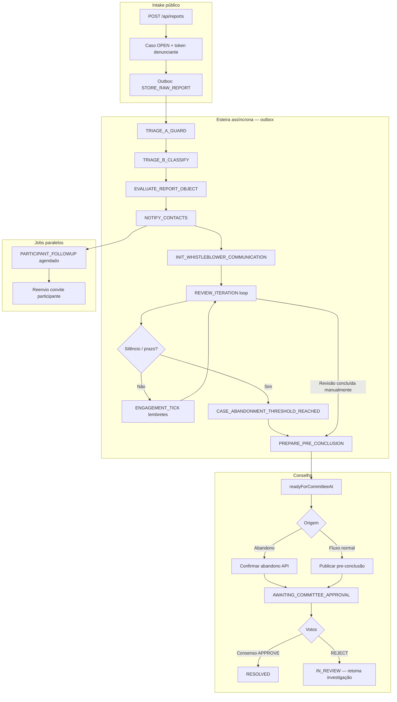

# Trilha da Denúncia — JobComplaint

Documento de referência: do primeiro contato do denunciante até o encerramento (ou abandono por silêncio), incluindo jobs autônomos e sinais de estagnação.

## 1. Visão geral do fluxo



## 2. Onde começa

| Momento | O quê | Persistência | Evento de auditoria |
|---------|-------|--------------|---------------------|
| Denúncia enviada | `POST /api/reports` | `Case`, `RawReport`, `WhistleblowerAccessToken` (hash), primeira mensagem outbox | `REPORT_SUBMITTED` |
| Token ao denunciante | Resposta da API (plaintext **uma vez**) | Apenas `tokenHash` no banco | — |
| SLA inicial | Criação do caso | `firstResponseDueAt`, `resolutionDueAt` | — |

**Motor:** a esteira não roda inline na API. Tudo passa pela **transactional outbox** processada por `POST /api/internal/outbox/process` (cron `scripts/outbox-cron.sh`).

## 3. Cadeia outbox (ordem típica)

| # | `PipelineAction` | O que faz | Próximo gatilho |
|---|------------------|-----------|-----------------|
| 1 | `STORE_RAW_REPORT` | Persiste narrativa/conversa | `TRIAGE_A_GUARD` |
| 2 | `TRIAGE_A_GUARD` | Anti-injeção IA | `TRIAGE_B_CLASSIFY` |
| 3 | `TRIAGE_B_CLASSIFY` | Triagem/categoria/risco | `EVALUATE_REPORT_OBJECT` |
| 4 | `EVALUATE_REPORT_OBJECT` | Orquestrador investigativo, convites, implicados | `NOTIFY_CONTACTS` |
| 5 | `NOTIFY_CONTACTS` | E-mail convites + alerta crítico | `INIT_WHISTLEBLOWER_COMMUNICATION` + `PARTICIPANT_FOLLOWUP` (delay) |
| 6 | `INIT_WHISTLEBLOWER_COMMUNICATION` | Primeira pergunta ao denunciante, plano 14 dias | `REVIEW_ITERATION` (via mensagens) |
| 7 | `REVIEW_ITERATION` | Ciclo IA + perguntas + reinferência implicados | Novo tick ou pre-conclusão |
| 8 | `ENGAGEMENT_TICK` | Lembrete ou **abandono automático** | Loop diário ou `PREPARE_PRE_CONCLUSION` |
| 9 | `PARTICIPANT_FOLLOWUP` | Lembrete a participantes sem resposta | Reagenda até max tentativas |
| 10 | `PREPARE_PRE_CONCLUSION` | Pacote IA + `readyForCommitteeAt` | Ação humana do conselho |

Código central: `src/lib/intake/stages.ts` + `src/lib/intake/processor.ts`.

## 4. Interação do denunciante (portal `/acompanhar`)

| Ação | API | Efeito na esteira |
|------|-----|-------------------|
| Consulta status | `POST /api/tracking/lookup` | Atualiza polling UI |
| Nova mensagem | `POST /api/tracking/messages` | Dispara `REVIEW_ITERATION`, reinferência, possível nova pergunta |

**Estados exibidos** (`WhistleblowerInteractionStatus`): `ANALYZING`, `AWAITING_YOUR_REPLY`, `PROCESSING_YOUR_MESSAGE`, `SYNTHESIZING`, `PRE_CONCLUSION`, etc.

## 5. Como termina — três desfechos principais

### A) Conclusão normal (com participação)

1. Revisão iterativa conclui (`reviewConcludedAt` preenchido).
2. Conselho publica pre-conclusão → `CASE_PRE_CONCLUSION_PUBLISHED_TO_COMMITTEE`.
3. Status `AWAITING_COMMITTEE_APPROVAL`.
4. Votos unânimes `APPROVE` → `CASE_RESOLVED_BY_COMMITTEE_CONSENSUS` → **`RESOLVED`**.

### B) Conclusão por abandono (silêncio)

1. `ENGAGEMENT_TICK` detecta: pergunta pendente + inatividade ≥ `ABANDONMENT_WINDOW_DAYS` (ou prazo do plano).
2. Evento `CASE_ABANDONMENT_THRESHOLD_REACHED`.
3. Mensagem ao denunciante + enfileira `PREPARE_PRE_CONCLUSION`.
4. Conselho usa **Confirmar abandono** → `CASE_ABANDONMENT_CONFIRMED_BY_COMMITTEE`.
5. Votação → `RESOLVED` (mesmo fluxo de comitê).

### C) Devolução à investigação

1. Comitê vota `REJECT` → `CASE_RETURNED_TO_INVESTIGATION_BY_COMMITTEE_REJECTION`.
2. Status volta `IN_REVIEW` — esteira pode continuar com novas iterações.

## 6. Jobs e autonomia do sistema

O sistema **não** usa cron por caso. Usa **fila outbox + ticks agendados**:

| Job / mecanismo | Disparo | Movimentação autônoma |
|-----------------|---------|------------------------|
| `outbox-cron.sh` | Cron SO / sidecar (5 min) | Processa lote outbox (`processOutboxUntilIdle`) |
| `ENGAGEMENT_TICK` | `nextContactAt` vencido no plano | Lembrete **ou** abandono → pre-conclusão |
| `PARTICIPANT_FOLLOWUP` | `availableAt` após convite | Reenvia convite (novo token) |
| `REVIEW_ITERATION` | Mensagem denunciante / outbox | Perguntas, implicados, bloqueios |

**Pré-requisito operacional:** sem cron da outbox, a denúncia **fica parada** após o intake (sinal `OUTBOX_PENDING_AGED`).

## 7. Estagnação — como o sistema “sabe” que parou

Módulo: `src/lib/pipeline/lifecycle.ts` (`assessStagnation`).

| Sinal | Significado | Movimento sugerido |
|-------|-------------|-------------------|
| `OUTBOX_PENDING_AGED` | Fila não processada | Rodar cron / `process` |
| `OUTBOX_FAILED` / `OUTBOX_DEAD` | Erro permanente | Ops + `MANUAL_REVIEW` |
| `WHISTLEBLOWER_SILENT` | Pergunta pendente, tick vencido | `ENGAGEMENT_TICK` |
| `PARTICIPANT_UNRESPONSIVE` | Convite sem resposta | `PARTICIPANT_FOLLOWUP` |
| `ENGAGEMENT_STEP_OVERDUE` | Plano adaptativo atrasado | `ENGAGEMENT_TICK` |
| `PRE_CONCLUSION_READY_UNPUBLISHED` | Pacote pronto, comitê não publicou | Ação humana conselho |
| `COMMITTEE_VOTE_PENDING` | Aguardando votos | Ação humana comitê |

**Classificação de desfecho:** `classifyComplaintOutcome()` → `IN_PROGRESS`, `ABANDONED_BY_SILENCE`, `RESOLVED_BY_COMMITTEE`, etc.

## 8. Plano adaptativo de engajamento (~14 dias)

Criado em `ensureAdaptiveEngagementPlan`:

| Seq | Tipo | Dia aprox. | Status esperado |
|-----|------|------------|-----------------|
| 1–2 | `REVIEW_CYCLE` | 0, 2 | Revisões IA |
| 3 | `PARTICIPANT_FOLLOWUP` | 5 | Cobrança participantes |
| 4 | `REVIEW_CYCLE` | 8 | Revisão |
| 5 | `PRE_CONCLUSION_CHECK` | 12 | Checagem pré-conclusão |

Ticks adicionais `STATUS_UPDATE` são agendados após cada `ENGAGEMENT_TICK` (+24h).

## 9. Dados sensíveis no banco

| Dado | Função | Domínio cripto |
|------|--------|----------------|
| Narrativa, mensagens, descrição | Texto variável | `protectField("SENSITIVE_TEXT")` |
| E-mail participante (formato legado) | E-mail isolado | `protectField("EMAIL")` |
| Perfil participante JSON | Nome + contact | `SENSITIVE_TEXT` (via `encryptSensitiveText`) |
| Tokens (denunciante, convite) | **Só hash** | `hashFieldValue` / `hashInviteToken` — irreversível |

**Dev:** `NODE_ENV !== production` → texto legível por padrão. Override: `DB_FIELD_ENCRYPTION=true|false`.

Ver `src/lib/field-crypto.ts`.

## 10. E-mail

Provedor configurável via `MAIL_PROVIDER`:

| Valor | Comportamento |
|-------|---------------|
| `ses` | Amazon SES (`AWS_SES_REGION`, `AWS_SES_FROM_EMAIL`, credenciais AWS) |
| `cloudflare` | Cloudflare Email REST (`CLOUDFLARE_ACCOUNT_ID`, `CLOUDFLARE_EMAIL_API_TOKEN`, `CLOUDFLARE_EMAIL_FROM`) |

API: `sendMail()` em `src/lib/mail/index.ts`. **Apenas `ses` e `cloudflare` são suportados.**

## 11. Apuração em desenvolvimento

```bash
# Ver processo completo de um caso (requer x-debug-key se configurado)
GET /api/dev/cases/{externalId}/full-process

# Métricas operacionais
GET /api/ops/status   # outbox.pending/failed/dead

# Processar fila manualmente
POST /api/internal/outbox/process
```

## 12. Próximas evoluções sugeridas

- [x] Endpoint `GET /api/ops/pipeline/stagnation` usando `assessStagnation`
- [ ] Worker que avalia estagnação e re-enfileira ações sem intervenção humana
- [ ] Provedor adicional além de SES e Cloudflare (fora de escopo)
- [ ] Dashboard visual da trilha por caso (timeline a partir de `auditEvents`)
